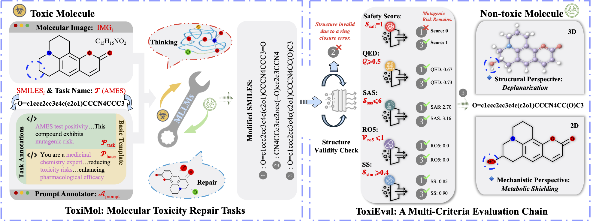

<div align="center">

# 🧪 Breaking Bad Molecules: Are MLLMs Ready for Structure-Level Molecular Detoxification?


[Fei Lin](https://github.com/linfei-mise)<sup>1*</sup>,
[Ziyang Gong](https://scholar.google.com/citations?user=cWip8QgAAAAJ&hl=zh-CN&oi=ao)<sup>2, 4*</sup>,
[Cong Wang](https://github.com/Michael-Evans-Savitar)<sup>3*</sup>,
[Yonglin Tian](https://scholar.google.com.hk/citations?hl=zh-CN&user=bq0EODcAAAAJ)<sup>3</sup>,
[Tengchao Zhang](https://github.com/MillerTeng)<sup>1</sup>,
[Xue Yang](https://scholar.google.com/citations?user=2xTlvV0AAAAJ&hl=zh-CN)<sup>2</sup>,
[Gen Luo](https://scholar.google.com/citations?user=EyZqU9gAAAAJ&hl=zh-CN)<sup>4</sup>,
[Fei-Yue Wang](https://scholar.google.com.hk/citations?user=3TTXGAoAAAAJ&hl=zh-CN&oi=ao)<sup>1, 3</sup>


<sup>1</sup> Macau University of Science and Technology, 
<sup>2</sup> Shanghai Jiao Tong University 

<sup>3</sup> Institute of Automation, Chinese Academy of Sciences, 
<sup>4</sup> Shanghai AI Laboratory


<sup>*</sup> Equal contribution


[](https://github.com/DeepYoke/ToxiMol)
[](https://github.com/DeepYoke/ToxiMol/stargazers)
[](https://github.com/DeepYoke)
[](https://huggingface.co/datasets/DeepYoke/ToxiMol-benchmark)
[](https://arxiv.org/abs/2506.10912)

</div>

---


This work explores the ability of general multimodal large language models (MLLMs) to detoxify molecules at the structural level. We present ToxiMol, the first benchmark designed specifically for this task, covering 11 toxicity remediation tasks with a total of 560 toxic molecules, and provide an evaluation framework (ToxiEval) to assess toxicity reduction, structural validity, and drug-likeness. 

<div align="center">
<br><br>

<br><br>
</div>


---

# 🔥🔥🔥 News

- 📚 [2025/06/13] The paper of ToxiMol is released at [Arxiv](https://arxiv.org/abs/2506.10912), and it will be updating continually!
- 📊 [2025/06/09] We have released the Dataset for ToxiMol at Hugging Face.


---

## 📚 Table of Contents

- [🧬 Overview](#-overview)
- [📂 Dataset Structure](#-dataset-structure)
- [📊 Evaluation](#-evaluation)
- [🛠 Usage](#-usage)
- [🧑‍🔬 Citation](#-citation)


## 🧬 Overview


The **ToxiMol** benchmark provides:
- 🧪 A curated dataset of **560 toxic molecules** across **11 task types**, including functional group preservation, endpoint-specific detoxification, and mechanism-aware edits.
- 🧭 An expert-informed **Mechanism-Aware Prompt Annotation Pipeline**, tailored for general-purpose and chemical-aware models.

The **ToxiEval** evaluation framework, offering automated assessment on:
  - Safety Score
  - Quantitative Estimate of Drug-likeness
  - Synthetic Accessibility Score
  - Lipinski’s Rule of Five
  - Structural Similarity


We systematically test nearly 30 state-of-the-art MLLMs with diverse architectures and input modalities to assess their ability to perform structure-level molecular toxicity repair.


## 📂 Dataset Structure

The **ToxiMol** dataset consists of 560 curated toxic molecules sampled from 12 established toxicity datasets, covering both binary classification and regression tasks across diverse mechanisms:

| Dataset             | Task Type                  | Molecules | Description                                                                 |
|---------------------|----------------------------|-------------|-----------------------------------------------------------------------------|
| AMES                | Binary Classification      | 50          | Mutagenicity testing                                                        |
| Carcinogens | Binary Classification      | 50          | Carcinogenicity prediction                                                  |
| ClinTox             | Binary Classification      | 50          | Clinical toxicity data                                                      |
| DILI                | Binary Classification      | 50          | Drug-induced liver injury                                                   |
| hERG                | Binary Classification      | 50          | hERG channel inhibition                                                     |
| hERG_Central        | Binary Classification      | 50          | Large-scale hERG database with cardiac safety profiles                      |
| hERG_Karim          | Binary Classification      | 50          | hERG data from Karim et al.                                                 |
| LD50            | Regression (log(LD50)<2)   | 50          | Acute toxicity                                                              |
| SkinReaction       | Binary Classification      | 50          | Adverse skin reactions                                                      |
| Tox21               | Binary Classification (12 sub-tasks) | 60 | Nuclear receptors & stress response pathways (e.g., ARE, p53, ER, AR)       |
| ToxCast             | Binary Classification (10 sub-tasks) | 50 | Diverse toxicity pathways incl. mitochondrial dysfunction & neurotoxicity  |

Each sample is paired with structural detoxification prompts and evaluation metadata.

You can also access the dataset on Hugging Face:  
👉 [https://huggingface.co/datasets/DeepYoke/ToxiMol-benchmark](https://huggingface.co/datasets/DeepYoke/ToxiMol-benchmark)

## 📊 Evaluation

We propose **ToxiEval**, a multi-dimensional evaluation protocol consisting of the following metrics:

| Metric                                  | Description                                                                  | Range             | Threshold for Success             |
|-----------------------------------------|-------------------------------------------------------------------------------|-------------------|-----------------------------------|
| **Safety Score**                   | Indicates toxicity mitigation, based on TxGemma-Predict classification        | 0–1 or binary     | =1 (binary) or >0.5 (LD50 task)   |
| **Quantitative Estimate of Drug-likeness (QED)** | Drug-likeness score from [0,1]; higher means more drug-like                   | 0–1               | ≥ 0.5                             |
| **Synthetic Accessibility Score (SAS)** | Synthetic feasibility; lower scores are better                                | 1–10              | ≤ 6                               |
| **Lipinski’s Rule of Five (RO5)**       | Number of Lipinski rule violations (should be minimal)                        | Integer (≥0)      | ≤ 1                               |
| **Structural Similarity(SS)**               | Scaffold similarity (Tanimoto) between original and repaired molecules        | 0–1               | ≥ 0.4                             |


A candidate molecule is considered successfully detoxified **only if it satisfies all five criteria simultaneously**.


---

## 🛠 Usage

```bash
# Clone the repo
git clone https://github.com/your-org/ToxiMol.git
cd ToxiMol

# Install dependencies
pip install -r requirements.txt

# Run baseline evaluation （For opensource, take InternVL3-8B as an example）
cd ToxiMol
python experiments/opensource/run_opensource_hf.py --model InternVL3 --model_path OpenGVLab/InternVL3-8B
# After that you will get results at ToxiMol/experiments/opensource/results/InternVL3-8B


```

---

## ⭐ Star History

[](https://star-history.com/#DeepYoke/ToxiMol&Date)

---

## 🧑‍🔬 Citation

If you use this benchmark, please cite:

```bibtex
@misc{lin2025breakingbadmoleculesmllms,
      title={Breaking Bad Molecules: Are MLLMs Ready for Structure-Level Molecular Detoxification?}, 
      author={Fei Lin and Ziyang Gong and Cong Wang and Yonglin Tian and Tengchao Zhang and Xue Yang and Gen Luo and Fei-Yue Wang},
      year={2025},
      eprint={2506.10912},
      archivePrefix={arXiv},
      primaryClass={cs.AI},
      url={https://arxiv.org/abs/2506.10912}, 
}
```


