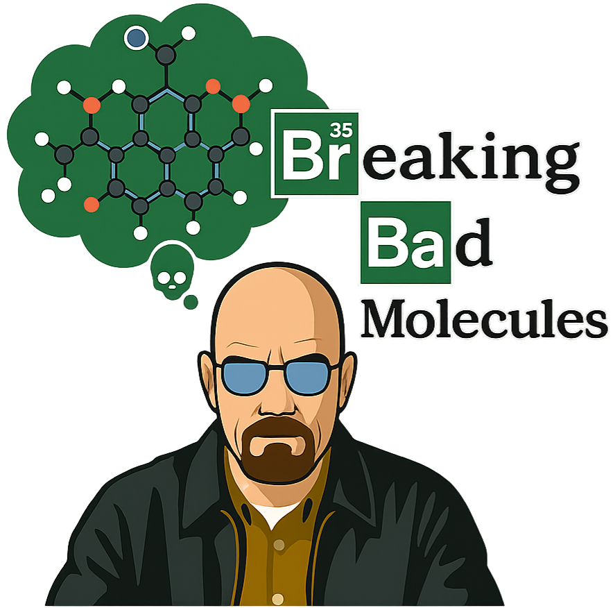

<div align="center">

#  Breaking Bad Molecules: Are MLLMs Ready for Structure-Level Molecular Detoxification?


[Fei Lin](https://github.com/linfei-mise)<sup>1*</sup>,
[Ziyang Gong](https://scholar.google.com/citations?user=cWip8QgAAAAJ&hl=zh-CN&oi=ao)<sup>2, 4*</sup>,
[Cong Wang](https://github.com/Michael-Evans-Savitar)<sup>3*</sup>,
[Yonglin Tian](https://scholar.google.com.hk/citations?hl=zh-CN&user=bq0EODcAAAAJ)<sup>3</sup>,
[Tengchao Zhang](https://github.com/MillerTeng)<sup>1</sup>,
[Xue Yang](https://scholar.google.com/citations?user=2xTlvV0AAAAJ&hl=zh-CN)<sup>2</sup>,
[Gen Luo](https://scholar.google.com/citations?user=EyZqU9gAAAAJ&hl=zh-CN)<sup>4</sup>,
[Fei-Yue Wang](https://scholar.google.com.hk/citations?user=3TTXGAoAAAAJ&hl=zh-CN&oi=ao)<sup>1, 3</sup>


<sup>1</sup> Macau University of Science and Technology, 
<sup>2</sup> Shanghai Jiao Tong University 

<sup>3</sup> Institute of Automation, Chinese Academy of Sciences, 
<sup>4</sup> Shanghai AI Laboratory


<sup>*</sup> Equal contribution


[](https://github.com/DeepYoke/ToxiMol)
[](https://github.com/DeepYoke/ToxiMol/stargazers)
[](https://github.com/DeepYoke)
[](https://huggingface.co/datasets/DeepYoke/ToxiMol-benchmark)
[](https://arxiv.org/abs/2506.10912)

</div>

---


This work investigates the capacity of general Multimodal Large Language Models (MLLMs) to perform structure-level molecular refinement for **toxicity repair tasks**. We present **ToxiMol**, the first benchmark designed explicitly for this task, which encompasses 11 toxicity remediation tasks involving a total of 560 toxic molecules. We also provide an evaluation framework (**ToxiEval**) to assess toxicity reduction, structural validity, drug-likeness, and other relevant properties. 

<div align="center">
<br><br>

<br><br>
</div>


---

# 🔥🔥🔥 News

- 📚 [2025/06/13] The paper of ToxiMol is released at [arXiv](https://arxiv.org/abs/2506.10912), and it will be updated continually!
- 📊 [2025/06/09] We have released the Dataset for ToxiMol at [Hugging Face](https://huggingface.co/datasets/DeepYoke/ToxiMol-benchmark).


---

## 📚 Table of Contents

  - [🧬 Overview](#-overview)
  - [📂 Dataset Structure](#-dataset-structure)
  - [📊 Evaluation](#-evaluation)
    - [Implementation Details](#implementation-details)
  - [🛠 Usage](#-usage)
    - [🚀 Quick Start](#-quick-start)
    - [📊 Dataset Access](#-dataset-access)
    - [🤖 Running Experiments](#-running-experiments)
      - [Option 1: OpenAI GPT Models](#option-1-openai-gpt-models)
      - [Option 2: Open-Source MLLMs](#option-2-open-source-mllms)
    - [📈 Evaluation](#-evaluation-1)
      - [Example Commands](#example-commands)
    - [📁 Output Structure](#-output-structure)
      - [Experiment Results (Raw Model Outputs):](#experiment-results-raw-model-outputs)
      - [Evaluation Results (ToxiEval Framework Outputs):](#evaluation-results-toxieval-framework-outputs)
    - [⚡ Advanced Usage](#-advanced-usage)
    - [👀 Q\&As](#-qas)
  - [🫶🏻 Acknowledgement](#-acknowledgement)
    - [TDC](#tdc)
    - [TxGemma](#txgemma)
    - [RDKit](#rdkit)
    - [Synthetic Accessibility Score (SAS)](#synthetic-accessibility-score-sas)
  - [⭐ Star History](#-star-history)
  - [🧑‍🔬 Citation](#-citation)


## 🧬 Overview


The **ToxiMol** benchmark provides:
- 🧪 A curated dataset of **560 toxic molecules** across **11 task types**, including functional group preservation, endpoint-specific detoxification, and mechanism-aware edits.
- 🧭 An expert-informed **Mechanism-Aware Prompt Annotation Pipeline**, tailored for general-purpose and chemical-aware models.

The **ToxiEval** evaluation framework, offers an automated assessment on:
  - Safety Score
  - Quantitative Estimate of Drug-likeness
  - Synthetic Accessibility Score
  - Lipinski’s Rule of Five
  - Structural Similarity


We systematically test nearly 30 state-of-the-art MLLMs with diverse architectures and input modalities to assess their ability to perform structure-level molecular toxicity repair.


## 📂 Dataset Structure

To construct a representative and challenging benchmark for molecular toxicity repair, we systematically define **11 toxicity repair tasks** based on all toxicity prediction tasks under the **"Single-instance Prediction Problem"** category from the [**Therapeutics Data Commons (TDC) platform**](https://tdcommons.ai/single_pred_tasks/tox/). 

The **ToxiMol** dataset consists of 560 curated toxic molecules covering both binary classification and regression tasks across diverse toxicity mechanisms. The **Tox21** dataset retains all of its 12 original sub-tasks, while 10 sub-tasks are randomly selected from the **ToxCast** dataset. All task names are kept consistent with those in the original datasets.

| Dataset             | Task Type                  | Molecules | Description                                                                 |
|---------------------|----------------------------|-------------|-----------------------------------------------------------------------------|
| AMES                | Binary Classification      | 50          | Mutagenicity testing via Ames assay                                        |
| Carcinogens         | Binary Classification      | 50          | Carcinogenicity prediction                                                  |
| ClinTox             | Binary Classification      | 50          | Clinical toxicity from failed trials                                       |
| DILI                | Binary Classification      | 50          | Drug-induced liver injury                                                   |
| hERG                | Binary Classification      | 50          | hERG channel inhibition (cardiotoxicity)                                   |
| hERG_Central        | Binary Classification      | 50          | Large-scale hERG database with cardiac safety profiles                     |
| hERG_Karim          | Binary Classification      | 50          | Integrated hERG dataset from multiple sources                              |
| LD50_Zhu            | Regression (log(LD50)<2)   | 50          | Acute toxicity lethal dose prediction                                       |
| Skin Reaction       | Binary Classification      | 50          | Adverse skin sensitization reactions                                        |
| Tox21               | Binary Classification (12 sub-tasks) | 60 | Nuclear receptors & stress response pathways (e.g., ARE, p53, ER, AR)     |
| ToxCast             | Binary Classification (10 sub-tasks) | 50 | Diverse toxicity pathways including mitochondrial dysfunction & neurotoxicity |

Each sample is paired with structural detoxification prompts and comprehensive evaluation metadata. The benchmark covers approximately 30 distinct small-molecule toxicity mechanisms, providing a comprehensive testbed for molecular detoxification methods.

You can also access the dataset on Hugging Face:  
👉 [https://huggingface.co/datasets/DeepYoke/ToxiMol-benchmark](https://huggingface.co/datasets/DeepYoke/ToxiMol-benchmark)

## 📊 Evaluation

We propose **ToxiEval**, a multi-dimensional evaluation protocol consisting of the following metrics:

| Metric                                  | Description                                                                  | Range             | Threshold for Success             |
|-----------------------------------------|-------------------------------------------------------------------------------|-------------------|-----------------------------------|
| **Safety Score**                   | Indicates toxicity mitigation, based on TxGemma-Predict classification        | 0–1 or binary     | =1 (binary) or >0.5 (LD50 task)   |
| **Quantitative Estimate of Drug-likeness (QED)** | Drug-likeness score from [0,1]; higher means more drug-like                   | 0–1               | ≥ 0.5                             |
| **Synthetic Accessibility Score (SAS)** | Synthetic feasibility; lower scores are better                                | 1–10              | ≤ 6                               |
| **Lipinski’s Rule of Five (RO5)**       | Number of Lipinski rule violations (should be minimal)                        | Integer (≥0)      | ≤ 1                               |
| **Structural Similarity(SS)**               | Scaffold similarity (Tanimoto) between original and repaired molecules        | 0–1               | ≥ 0.4                             |


A candidate molecule is considered successfully detoxified **only if it satisfies all five criteria simultaneously**.

### Implementation Details

- **Safety Score**: Computed using [txgemma-9b-predict](https://huggingface.co/collections/google/txgemma-release-67dd92e931c857d15e4d1e87) by default in [`evaluation/molecule_utils.py`](evaluation/molecule_utils.py). Users can choose 2b/9b/27b variants - see ablation studies in our [paper](https://arxiv.org/abs/2506.10912).

- **SAS Score**: Calculated using [`evaluation/sascorer.py`](evaluation/sascorer.py) and [`evaluation/fpscores.pkl.gz`](evaluation/fpscores.pkl.gz) from [RDKit Contrib](https://github.com/rdkit/rdkit/tree/master/Contrib/SA_Score).

- **TxGemma TDC Prompts**: Task-specific prompts stored in [`evaluation/tdc_prompts.json`](evaluation/tdc_prompts.json), sourced from [TxGemma's official release](https://huggingface.co/collections/google/txgemma-release-67dd92e931c857d15e4d1e87).

---

## 🛠 Usage

### 🚀 Quick Start

```bash
# Clone the repository
git clone https://github.com/DeepYoke/ToxiMol.git --recursive
cd ToxiMol

# Install dependencies
pip install -r requirements.txt
```

To run DeepSeek-VL V2, we recommend setting up a new Conda virtual environment following the instructions at [DeepSeek-VL2 GitHub](https://github.com/deepseek-ai/DeepSeek-VL2.git). Once the environment is activated, please execute the following commands:

```bash
cd experiments/opensource/DeepSeek
# Install dependencies
pip install -e .
```

### 📊 Dataset Access

The **ToxiMol** dataset is hosted on Hugging Face:

```python
from datasets import load_dataset

# Load a specific task
dataset = load_dataset("DeepYoke/ToxiMol-benchmark", data_dir="ames", split="train", trust_remote_code=True)
```

**Available tasks:** `ames`, `carcinogens_lagunin`, `clintox`, `dili`, `herg`, `herg_central`, `herg_karim`, `ld50_zhu`, `skin_reaction`, `tox21`, `toxcast`

### 🤖 Running Experiments

#### **Option 1: OpenAI GPT Models**

For **closed-source MLLMs**, we provide GPT series as an example. Any GPT model supporting text+image input can be tested (e.g., `gpt-4.1`, `gpt-4o`, `gpt-o3`), provided your API key has access.

```bash
# Run single task
python experiments/gpt/run_toxicity_repair.py \
    --task ames \
    --model gpt-4.1 \
    --api-key YOUR_OPENAI_API_KEY

# Run all tasks
python experiments/gpt/run_toxicity_repair.py \
    --task all \
    --model gpt-4.1 \
    --api-key YOUR_OPENAI_API_KEY

# Limit molecules per task (useful for testing)
python experiments/gpt/run_toxicity_repair.py \
    --task ames \
    --model gpt-4.1 \
    --api-key YOUR_OPENAI_API_KEY \
    --limit 10
```

#### **Option 2: Open-Source MLLMs**

```bash
# InternVL3 (recommended)
python experiments/opensource/run_opensource.py \
    --task ames \
    --model internvl3 \
    --model_path OpenGVLab/InternVL3-8B

# DeepSeek-VL V2
python experiments/opensource/run_opensource.py \
    --task all \
    --model deepseekvl2 \
    --model_path deepseek-ai/deepseek-vl2-small

# LLaVA-OneVision
python experiments/opensource/run_opensource.py \
    --task clintox \
    --model llava-onevision \
    --model_path lmms-lab/llava-onevision-qwen2-7b-ov

# Qwen2.5-VL
python experiments/opensource/run_opensource.py \
    --task herg \
    --model qwen2.5vl \
    --model_path Qwen/Qwen2.5-VL-7B-Instruct
```

**Available Tasks:** `ames`, `carcinogens_lagunin`, `clintox`, `dili`, `herg`, `herg_central`, `herg_karim`, `ld50_zhu`, `skin_reaction`, `tox21`, `toxcast`, `all`

**Supported Models:** `internvl3`, `deepseekvl2`, `llava-onevision`, `qwen2.5vl`

### 📈 Evaluation

After running experiments, evaluate the results using our **ToxiEval** framework with the `--full` parameter:

```bash
python evaluation/run_evaluation.py \
    --results-dir experiments/opensource/results \
    --model InternVL3-8B \
    --full
```

#### **Example Commands**

```bash
# Evaluate specific model and task
python evaluation/run_evaluation.py \
    --results-dir experiments/gpt/results \
    --model gpt-4.1 \
    --task ames \
    --full

# Evaluate all tasks for a model
python evaluation/run_evaluation.py \
    --results-dir experiments/gpt/results \
    --model gpt-4.1 \
    --full

# Evaluate open-source model results
python evaluation/run_evaluation.py \
    --results-dir experiments/opensource/results \
    --model llava-one-vision-72b \
    --full
```

### 📁 Output Structure

Results are organized as follows:

#### **Experiment Results (Raw Model Outputs):**
```
experiments/
├── gpt/results/
│   └── gpt-4.1/
│       ├── ames/ames_results.json
│       ├── clintox/clintox_results.json
│       └── overall_summary.json
└── opensource/results/
    └── llava-one-vision-72b/
        ├── ames/ames_results.json
        ├── herg/herg_results.json
        └── overall_summary.json
```

#### **Evaluation Results (ToxiEval Framework Outputs):**
```
experiments/eval_results/
└── Qwen2.5-VL-32B-Instruct/
    └── all_tasks/
        ├── all_tasks_evaluation_summary.json
        ├── all_tasks_evaluation_summary.csv
        ├── tox21_subtasks_evaluation_summary.json
        ├── tox21_subtasks_evaluation_summary.csv
        ├── toxcast_subtasks_evaluation_summary.json
        └── toxcast_subtasks_evaluation_summary.csv
```

### ⚡ Advanced Usage

**Custom Generation Parameters:**
```bash
python experiments/opensource/run_opensource.py \
    --task ames \
    --model internvl3 \
    --model_path OpenGVLab/InternVL3-8B \
    --temperature 0.7 \
    --max-tokens 1024
```

**Process Specific Molecules:**
```bash
python experiments/gpt/run_toxicity_repair.py \
    --task ames \
    --model gpt-4.1 \
    --api-key YOUR_OPENAI_API_KEY \
    --molecule-ids 1 5 10 15
```

**Custom Output Directory:**
```bash
python evaluation/run_evaluation.py \
    --results-dir experiments/opensource/results \
    --output-dir custom_eval_results \
    --full
```


### 👀 Q&As
**If the code fails to extract simles, please manually extract:**
```bash
python evaluation/extract_smiles.py \
    --results-dir experiments/opensource/results/model_type
``` 
**If you encounter the error of "TypeError: process_vision_info() got an unexpected keyword argument", please try:**
```bash
pip install qwen-vl-utils==0.0.10
```
---

## 🫶🏻 Acknowledgement

We sincerely thank the developers and contributors of the following tools and resources, which made this project possible. This project makes use of several external assets for molecular processing and evaluation. All assets are used in accordance with their respective licenses and terms of use:

### TDC

Used for toxicity datasets that form the foundation of the ToxiMol benchmark. Provided by [Therapeutics Data Commons](https://tdcommons.ai/).

- **License:** MIT License  
- **Official Website:** [tdcommons.ai](https://tdcommons.ai/)  
- **Official GitHub:** [github.com/mims-harvard/TDC](https://github.com/mims-harvard/TDC)  
- **Papers:** 
  - [TDC-2: Multimodal foundation for therapeutic science](https://www.biorxiv.org/content/10.1101/2024.06.12.598655v3.full.pdf) (bioRxiv 2024)
  - [Therapeutics data commons: Machine learning datasets and tasks for drug discovery and development](https://arxiv.org/pdf/2102.09548) (arXiv 2021)
  - [Artificial intelligence foundation for therapeutic science](https://doi.org/10.1038/s41589-022-01131-2) (Nature Chemical Biology 2022)

### TxGemma

Used for toxicity prediction tasks. Provided by Google via the [Hugging Face Transformers](https://huggingface.co/google/txgemma-9b-predict) library.

- **License:** [Health AI Developer Foundations Terms of Use](https://developers.google.com/health-ai-developer-foundations/terms)  
- **Official GitHub:** [gemma-cookbook](https://github.com/google-gemini/gemma-cookbook/tree/main/TxGemma)  
- **Paper:** [TxGemma: Efficient and Agentic LLMs for Therapeutics](https://arxiv.org/abs/2504.06196)

### RDKit

Used for computing QED, Lipinski’s Rule of Five (RO5), molecular similarity, and other molecular operations.

- **Version:** 2023.09.6  
- **License:** [BSD 3-Clause](https://opensource.org/licenses/BSD-3-Clause)  
- **Official GitHub:** [github.com/rdkit](https://github.com/rdkit)  
- **Website:** [rdkit.org](https://www.rdkit.org)

### Synthetic Accessibility Score (SAS)

Used to evaluate the synthetic feasibility of generated molecules. Implementation from RDKit Contrib directory by Peter Ertl and Greg Landrum.

- **License:** [BSD 3-Clause](https://opensource.org/licenses/BSD-3-Clause)  
- **Official GitHub:** [github.com/rdkit/rdkit/tree/master/Contrib/SA_Score](https://github.com/rdkit/rdkit/tree/master/Contrib/SA_Score)  
- **Paper:** [Estimation of synthetic accessibility score of drug-like molecules based on molecular complexity and fragment contributions](https://doi.org/10.1186/1758-2946-1-8) (Journal of Cheminformatics 2009)


---

## ⭐ Star History

[](https://star-history.com/#DeepYoke/ToxiMol&Date)

---

## 🧑‍🔬 Citation

If you use this benchmark, please cite:

```bibtex
@misc{lin2025breakingbadmoleculesmllms,
      title={Breaking Bad Molecules: Are MLLMs Ready for Structure-Level Molecular Detoxification?}, 
      author={Fei Lin and Ziyang Gong and Cong Wang and Yonglin Tian and Tengchao Zhang and Xue Yang and Gen Luo and Fei-Yue Wang},
      year={2025},
      eprint={2506.10912},
      archivePrefix={arXiv},
      primaryClass={cs.AI},
      url={https://arxiv.org/abs/2506.10912}, 
}
```

